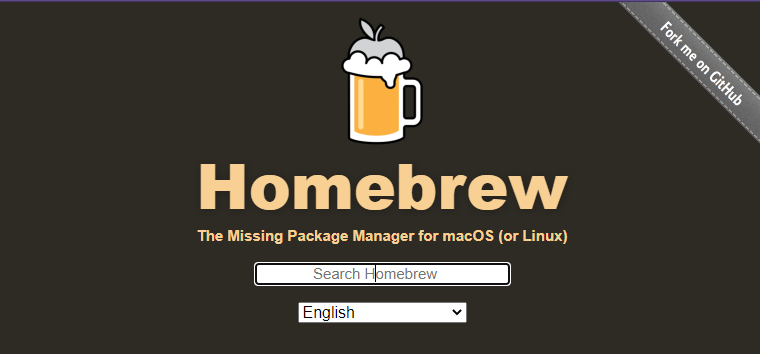
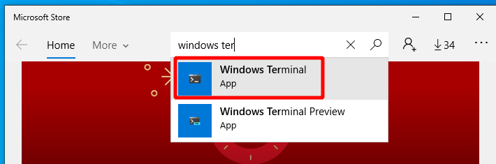

#  Clarusway of Development Environment

Whichever language or technology you are using it doesn't matter, somehow you will eventually meet with the black screen of terminal window. But this time, you are luckier than before, since there are many tools those will make your journey on that terminals. In this article we'll cover all major operating systems, including Windows 10, 8 and 7 from Microsoft, macOS from Apple, and Ubuntu variant of Linux.

Zsh is very customizable shell in unix platforms, Thanks to msys2 implementation on git for windows, and linux virtualization on windows sub-system for linux, in short WSL. You can have pleasure of this shell on windows platform too. Windows 10 has a shiny windows terminal application. Windows 8 and 7 users don't worry, there is an almost similar alternative to windows terminal app for you. It is cmder. We will install this terminal client for windows 7, 8.1 systems.

Developers use range variety of tools for daily work, but for sure git has the top priority. While working on projects, you probably writing code for a ticket in a branch. Sometimes it becomes difficult to keep track of the branch and commit status. From now on you can easily see your current branch and status from your prompt with the help of zsh, and its companion extension oh-my-zsh and also shining powerlevel10k theme. In addition to this trilogy, syntax highlighting and auto suggestion plugins on terminal will boost your productivity.

Users need to install, remove, upgrade, configure and manage software packages. This is a time consuming job. Linux distributions have package managers long time ago. Package managers help the user to install correct compatible version of desired software with its dependencies as well. You don't have to consider about downloading and installing of third party software, to run the application flawlessly.

Linux distributions usually have their own custom package manager, such as apt and apt-get for Ubuntu/Debian, yum and dnf  for Fedora/Redhat and zypper for OpenSUSE etc. On the macOS side there is a third party community tool called homebrew in short brew. For Windows family, there is also community/proprietary tool named chocolatey and scoop. For Windows package management we will choose chocolatey.

Let's define our roadmap of our development environment for those operating systems. First of all we will install package managers on each OS, and then we will continue to enhance terminal experience with terminal applications, fonts and shells. Some part of this journey shares common steps, so please follow each step one by one.


## Package Manager

### - Windows 10 and 8.1

- Install Chocolatey
  - [ ] Open `powershell.exe` with **[elevated rights](https://www.howtogeek.com/194041/how-to-open-the-command-prompt-as-administrator-in-windows-8.1/)** (click start and type `powershell.exe` then click the application with `ctrl+shift` pressed)

  - [ ] Now run the following command:

    ```powershell
    Set-ExecutionPolicy Bypass -Scope Process -Force; [System.Net.ServicePointManager]::SecurityProtocol = [System.Net.ServicePointManager]::SecurityProtocol -bor 3072; iex ((New-Object System.Net.WebClient).DownloadString('https://chocolatey.org/install.ps1'))
    ```

  *source: [Chocolatey.org](https://chocolatey.org/install#individual)*

### - Windows 7

- Install Chocolatey manually

  *Chocolatey.org now requires TLS 1.2 at a minimum. In Windows 7, we need to turn around this issue, therefore we will install Chocolatey manually.*

  - [ ] The first step with offline is to obtain a copy of the Chocolatey Nupkg (nupkg files are just fancy zip files). Download [the latest version directly](https://chocolatey.org/api/v2/package/chocolatey).

  - [ ] Unzip it using any application that supports `zip` format. You can just rename downloaded file e.g: `chocolatey.0.10.15.nupkg` --> `chocolatey.0.10.15.zip` and extract the file using windows explorer context menu.

  - [ ] Open `powershell.exe` with **elevated rights** (click start and type `powershell.exe` then click the application with `ctrl+shift` pressed) and navigate into the unzipped package's tools folder.

    ```powershell
    PS C:\...\chocolatey.0.10.15\tools> .\chocolateyInstall.ps1
    ```

    > *Note*: This will not set Chocolatey as an installed package, so it may be a good idea to also call `choco upgrade chocolatey -y` and let it reinstall the same version, but at least it will be available for upgrades then.

  *source: [Chocolatey.org](https://docs.chocolatey.org/en-us/choco/setup#completely-offline-install)*
  
  

### - macOS

- Install homebrew

  ```bash
  /bin/bash -c "$(curl -fsSL https://raw.githubusercontent.com/Homebrew/install/HEAD/install.sh)"
  ```
  
  


### - Linux

- Ubuntu users may continue with snap or apt. Snap repositories seem updated frequently than Ubuntu official repo. It is up to you.

  

## Git

### - Windows 10, 8.1 and Windows 7

- [ ] Open `powershell.exe` or `cmd.exe` with **elevated rights** (click start and type `powershell.exe` or `cmd.exe` then click the application with `ctrl+shift` pressed), and run

  ```powershell
  choco install git -y
  ```

  or you can install from https://gitforwindows.org/

- [ ] In order to enhance terminal experience, we need to [Configure git for windows](#Configure Git for Windows) by integrating some msys2 packages.

  

### - macOS

- [ ] `brew install git`

### - Linux

- [ ]  `sudo apt install git -y`  

### - Setting up .gitconfig file

- This setup is platform independent, you can either execute commands below or copy [.gitconfig][./.gitconfig] file to your home directory and change relevant lines with your identity using a text editor.

  ```bash
  git config --global user.name "Your Name"
  git config --global user.email "youremail@example.com"
  ```
  

## Configure Git for Windows

> If it is not installed yet, you can install with `choco install 7zip -y` on an elevated command prompt/or powershell, or you can download from https://www.7-zip.org/ 

- For 64 bit Windows Systems (x86_64) **[How to check](https://www.howtogeek.com/howto/21726/how-do-i-know-if-im-running-32-bit-or-64-bit-windows-answers/)**

  - Download files below: 
    - [ ] pacman, https://repo.msys2.org/msys/x86_64/pacman-5.2.2-4-x86_64.pkg.tar.xz
    - [ ] keyring,https://repo.msys2.org/msys/x86_64/msys2-keyring-1~20201002-1-any.pkg.tar.xz
    - [ ] repository mirror list, [pacman mirror list files](./mirrorlists.zip?raw=true)
  
- For 32 bit Windows Systems(x86):

  - Download files below:
    - [ ] pacman, https://repo.msys2.org/msys/i686/pacman-5.2.2-4-i686.pkg.tar.xz
    - [ ] keyring,https://repo.msys2.org/msys/x86_64/msys2-keyring-1~20201002-1-any.pkg.tar.xz
    - [ ] repository mirror list, [pacman mirror list files](./mirrorlists.zip?raw=true)
  
- For the both architecture:

  - [ ] Open these file with 7zip. There are one more archieve files within pacman and keyring files. Open inner ones and extract all folders and as well as mirrorlists.zip contents into git for windows directory  (default folder is c:\Program Files\Git\)

  - [ ] Open `git-bash.exe` with **elevated rights** (click start and type `git bash` then click the application with `ctrl+shift` pressed):

    ```bash
    set "PATH=%programfiles%\Git\usr\bin"
    bash pacman-key --init
    bash pacman-key --populate msys2
    bash pacman-key --refresh-keys
    pacman -Tv
    pacman -Syuv --overwrite='*'
    pacman --version
    pacman -Sv --noconfirm --overwrite='*' bash 
    # this install might stuck at infinite loop, if so
    # close git bash window and reopen it as elevated
    # run the last command again
    pacman -Sv --noconfirm --overwrite='*' rsync
    pacman -Sv --noconfirm --overwrite='*' util-linux 
    ```
    

*source: https://github.com/Alexpux/MSYS2-pacman/issues/50#issuecomment-602141995*
    
- [ ] Test if pacman is working:
  
  ```bash
    # tree command is not installed, run tree to check
    tree 
    # so let's install
    pacman -S tree
    # test tree command as below
    tree -dL 2
    pacman -S zsh --overwrite='*' --noconfirm
    # we are also doing one of major installation at the line above 😉
  ```
  
  > *Note: If you face any errors during installation of any package with pacman rerun the same install command with `--overwrite='*'` option*
  
- [ ] To configure directory mount points, Open `git-bash.exe` with **elevated rights** (click start and type `git bash` then click the application with `ctrl+shift` pressed) and run `nano /etc/fstab`
  
    ```bash
    # modify the lines below "DO NOT REMOVE NEXT LINE"
    
    # DO NOT REMOVE NEXT LINE. It remove cygdrive prefix from path
    none /mnt cygdrive binary,posix=0,noacl,user 0 0
    # All drives will be mounted under /mnt eg /mnt/c /mnt/d just like in WSL
    none /tmp usertemp binary,posix=0,noacl 0 0
    /mnt/c/Users /home auto bind,binary,posix=0,noacl,user 0 0
    # binding c:\Users to /home so user homedir will be /home/<user>
    ```
    
  
  Save and exit nano editor with `CTRL+X` and confirm changes.
  
  After restart, open git bash and type `pwd`, your user profile directory should be `/home/<username>`

## Fonts

  - The fonts we are installing here are powerline symbols added fonts. These fonts are also known as NerdFonts. Take a look at: https://www.nerdfonts.com/ . Here below shorthand for downloading our preferred fonts. MesloLGS NF is the recommended font for powerlevel10k theme. FiraCode is the one of most preferred coding editor font. FiraCode supports ligatures, joining of adjacent characters as a single one for readability. Here below are the powerline patched ones. You can also use it for the terminal windows as well, it is up to you.
    
  - MesloLGS NF: download these four ttf files below and install your OS:
    
    - [ ] [MesloLGS NF Regular.ttf](https://github.com/romkatv/powerlevel10k-media/raw/master/MesloLGS%20NF%20Regular.ttf)
    - [ ] [MesloLGS NF Bold.ttf](https://github.com/romkatv/powerlevel10k-media/raw/master/MesloLGS%20NF%20Bold.ttf)
    - [ ] [MesloLGS NF Italic.ttf](https://github.com/romkatv/powerlevel10k-media/raw/master/MesloLGS%20NF%20Italic.ttf)
    - [ ] [MesloLGS NF Bold Italic.ttf](https://github.com/romkatv/powerlevel10k-media/raw/master/MesloLGS%20NF%20Bold%20Italic.ttf)
    
      > Note: if you are macOS user and installed iterm2, powerlevel10k setup  `p10k configure` will automatically download MesloLGS NF fonts for you. Simply answer `Yes` when p10k asks you to install Meslo Nerd Font.
    
  - FiraCode NF: download these four ttf files below and install your OS:

    - [ ] [FiraCode NF Regular.ttf](https://github.com/ryanoasis/nerd-fonts/blob/master/patched-fonts/FiraCode/Regular/complete/Fira%20Code%20Regular%20Nerd%20Font%20Complete%20Windows%20Compatible.ttf?raw=true)
    
    - [ ] [FiraCode NF Bold.ttf](https://github.com/ryanoasis/nerd-fonts/blob/master/patched-fonts/FiraCode/Bold/complete/Fira%20Code%20Bold%20Nerd%20Font%20Complete%20Windows%20Compatible.ttf?raw=true)
    
    - [ ] [FiraCode NF Light.ttf](https://github.com/ryanoasis/nerd-fonts/blob/master/patched-fonts/FiraCode/Light/complete/Fira%20Code%20Light%20Nerd%20Font%20Complete%20Windows%20Compatible.ttf?raw=true)
    
    - [ ] [FiraCode NF Medium.ttf](https://github.com/ryanoasis/nerd-fonts/raw/master/patched-fonts/FiraCode/Medium/complete/Fira%20Code%20Medium%20Nerd%20Font%20Complete%20Windows%20Compatible.ttf)
    
      > Windows users can install via `choco install firacodenf -y` as well.

## Shell Setup

### - Install zsh

- **Windows 10**

  - [ ] Open `git-bash.exe` with **elevated rights** (click start and type `git bash` then click the application with `ctrl+shift` pressed) and run`pacman -S zsh --noconfirm --overwrite='*'`.

    > Please note that, in order to run above command, you should have [configured git for windows](./setup-git-win.md). 
  
- [ ] Open Windows Terminal from start menu, and select Ubuntu 20.04 from the list at the tab bar of the application, and run `sudo apt install zsh -y`
  
    > Please note that, in order to run above command, you should have configured Windows Terminal and WSL Ubuntu on [Terminal Emulator Windows 10 Section](#Terminal Emulator).

- **Windows 7,  8.1**

  - [ ] Open `git-bash.exe` with **elevated rights** (click start and type `git bash` then click the application with `ctrl+shift` and run`pacman -S zsh --noconfirm --overwrite='*'` 

    > Please note that, in order to run above command, you should have [configured git for windows](#Configure Git for Windows).
  
- **macOS**

  *macOS Catalina and beyond comes with zsh as default shell. However it is recommended to upgrade stock zsh via homebrew for your convenience. For macOS Mojave you need to install zsh.*

  - [ ] Open `terminal.app`or `iterm2.app`from launchpad or `in spotlight via Command + spacebar` and type iterm or terminal and in the terminal window run `brew install zsh`

- **Linux**

  - [ ] Open terminal app and run `sudo apt install zsh -y`

### - Install oh-my-zsh

Installation instructions in this section applies to all operating systems, please be advised that, for windows systems you need to complete git for windows installation and its configuration mentioned above.

- Run following command at bash/zsh shell terminal:

  ```bash
  sh -c "$(curl -fsSL https://raw.githubusercontent.com/robbyrussell/oh-my-zsh/master/tools/install.sh)"
  ```

*This will clone the repo and replace the existing* `~/.zshrc` *with a template from [oh-my-zsh.*](https://ohmyz.sh/)


*The install might have asked you to make* `zsh` *as your Login Shell. Due to implementation of shell on Git Bash, it is recommended to keep default shell as* `bash` *for git bash only. We will turn around this issue later on.*

*Except Git Bash, feel free to change your login shell for zsh when asked, or via running command:* `chsh -s $(which zsh)`  *This setting is user specific, no need to prefix* `sudo`

  - Install plugins:

    - [ ] Run following command to download zsh-autosuggestions:

      *This plugin will give instant suggestions in dimmed color while you type in zsh terminal*

      ```bash
      git clone https://github.com/zsh-users/zsh-autosuggestions.git $ZSH_CUSTOM/plugins/zsh-autosuggestions
      ```

    - [ ] Run following command to download zsh-syntax-highlighting:

      *This plugin will highlight correctly typed commands as green, wrong ones as red instantly while you type in zsh terminal*
      
      ```bash
      git clone https://github.com/zsh-users/zsh-syntax-highlighting.git $ZSH_CUSTOM/plugins/zsh-syntax-highlighting
      ```

  - Install powerlevel10k theme on oh-my-zsh and save into user profile:

    Take a look at romkatv's powerlevel10k repository: https://github.com/romkatv/powerlevel10k

    
    
    - [ ] Run following command on bash/zsh shell terminal windows on your computer:

    ```bash
git clone --depth=1 https://github.com/romkatv/powerlevel10k.git ${ZSH_CUSTOM:-$HOME/.oh-my-zsh/custom}/themes/powerlevel10k
    ```
    
    - [ ] Run `nano ~/.zshrc` in the terminal, find the line below and replace it with the second line:

      ```bash
      ZSH_THEME="robbyrussell"
      ```

      ```bash
    ZSH_THEME="powerlevel10k/powerlevel10k"
      ```
    
      

      and change the line for plugins  as below:
      
      ```bash
plugins=(git)
      ```
      
      ```bash
plugins=(git zsh-autosuggestions zsh-syntax-highlighting)
      ```
    
      
    
      Save and exit nano editor with `CTRL+X` and confirm changes.
    
    - [ ] Run `source ¨/.zshrc` command to update your terminal settings. Powerlevel10K initial setup p10k configure command will check some symbols visibility and configure look and feel as your preference. Recommended font for the terminal is MesloLGS NF, download links above.  For further details, please visit [Powerlevel10k repository](https://github.com/romkatv/powerlevel10k).
    
      
    
      *Powerlevel10k zsh vs bare bash console in windows 7 on cmder at git for windows*
    
      
    
    - [ ] My preferred powerlevel10k setup is as follows: ( You can reconfigure any time by `p10k configure`)
    
      - Prompt Style :point_right: (1) Lean
      - Character Set :point_right: (1) Unicode
      - Prompt Colors :point_right: (1) 256 colors
        - Show current time? :point_right: (1) No.
      - Prompt Height :point_right: (2) Two lines.
      - Prompt Connection:point_right: (1) Disconnected
      - Prompt Frame:point_right: (1) No frame.
      - Prompt Spacing:point_right: (1) Compact.
      - Icons :point_right: (2) Many icons.
      - Prompt Flow:point_right: (1) Concise.
      - Enable Transient Prompt :point_right: (y) Yes.
      - Instant Prompt Mode :point_right: (2) Quiet
      - Final confirmation :point_right: (y) Yes.
    
    > *Note: At the integrated terminal on visual studio code in windows 7, you may see redundant percent sign (%) on some terminals above the current prompt line.*
    >
    > 
    >
    > *To solve this redundancy enter following lines of commands in .zshrc file just after p10k-instant-prompt block below*
    >
    > ```shell
    > setopt PROMPT_CR
    > setopt PROMPT_SP
    > export PROMPT_EOL_MARK=""
    > ```
    >
    > 
    >
    > *source: https://superuser.com/a/645612*


## Terminal Emulator

### - Windows 10

  - **WSL Ubuntu 20.04 Setup**

    Before installing any Linux distributions on Windows, you must enable the "Windows Subsystem for Linux" optional feature.

    - [ ] Install the Windows Subsystem for Linux

      - [ ] Open `powershell.exe` with **[elevated rights](https://www.howtogeek.com/194041/how-to-open-the-command-prompt-as-administrator-in-windows-8.1/)** (click start and type `powershell.exe` then click the application with `ctrl+shift` pressed) and run following commands:

        ```powershell
        dism.exe /online /enable-feature /featurename:Microsoft-Windows-Subsystem-Linux /all /norestart
        dism.exe /online /enable-feature /featurename:VirtualMachinePlatform /all /norestart
        Restart-Computer
        ```

      - [ ] Set WSL 2 as your default version

        ```powershell
        wsl --set-default-version 2
        ```

      - [ ] Install WSL Ubuntu from the Windows Store. ([Ubuntu-20.04](https://aka.ms/wslubuntu2004))

        

        

      - [ ] or download via powershell or curl:

        ```powershell
        Invoke-WebRequest -Uri https://aka.ms/wslubuntu2004 -OutFile Ubuntu2004.appx -UseBasicParsing
        ```

        ```bash
        curl -L -o Ubuntu-2004.appx https://aka.ms/wslubuntu2004
        ```

        to install manually downloaded appx package:

        ```powershell
        Add-AppxPackage .\Ubuntu2004.appx
        ```

      - [ ] Launch `Ubuntu2004.exe` and do initial user name, and password stuff: (you will need this password when you need root access on WSL Ubuntu)

        

        Right click on the title bar, select Defaults:
        Under the Options tab, select `Use Ctrl+Shift+C/V as Copy/Paste`

      - [ ] Update WSL Ubuntu repository database and pre-installed applications by typing following command on Ubuntu console:

        ```bash
        sudo apt update && sudo apt upgrade && sudo apt autoremove -y
        ```

    - [ ] Changing directory colors:

      *Please check ls output colors in ntfs partitions, e.g. your user profile directory on windows, you may see some file's colors as inverted when you run* `ls` *command. The default colors used in* `ls`, *we have some bad background highlighting issues, let's fix that. Open Ubuntu-20.04 app* 

      - [ ] Create a `.dircolors` file as follows: `dircolors -p > ~/.dircolors`

        You now have a .dircolors file containing the color configuration for `ls`, which is stored in the env variable LS_COLORS. What we need to do next is make a change to the colors, and save it back to LS_COLORS.

      - [ ] Run`nano ~/.dircolors` , and modify with the settings below. We're removing the background from OTHER_WRITABLE, and fixing the font color for the rest:

        Change `SETUID` to: `SETUID 00;30;41`

        Change `SETGID` to: `SETUID 00;30;43`

        Change `CAPABILITY` to: `CAPABILITY 00;30;41`

        Change `STICKY_OTHER_WRITABLE` to: `STICKY_OTHER_WRITABLE 00;30;42`

        Change `OTHER_WRITABLE` to: `OTHER_WRITABLE 01;32`

        Change `STICKY` to: `STICKY 00;30;44`

        Save and exit `CTRL+X`and confirm changes.       

        - [ ] Edit `nano ~/.zshrc` and add the following line:  *please note to the back ticks* (`) *not single quote*(')

        ```bash
        eval `dircolors ~/.dircolors`
        ```

        - [ ] Save file and close nano and restart Ubuntu-20.04

      - [ ] Please follow [Shell Setup](#shell-setup) above in order to have zsh and oh-my-zsh and powerlevel10k theme triology on WSL Ubuntu as well.

 - **Windows Terminal**

    - [ ] Install Windows Terminal from the [Windows Store](https://aka.ms/terminal). 

    - [ ] or via powershell:

      ```powershell
      Invoke-WebRequest -Uri https://github.com/microsoft/terminal/releases/download/v1.4.3243.0/Microsoft.WindowsTerminal_1.4.3243.0_8wekyb3d8bbwe.msixbundle -OutFile wt.msixbundle -UseBasicParsing
      
      Add-AppxPackage .\wt.msixbundle
      ```
      
      
      
      
    
    Windows Terminal is configured for the build-in cmd.exe, powershell.exe and wsl ubuntu automatically. However we still need to change default fonts and some stuff to beautify our terminal, and also we need to add git bash and git zsh entries to windows terminal setting file. Let's do that.
    
    - [ ] For your convenience, prior to setting up windows terminal, it is advised to install visual studio code, since you can use vscode to edit configuration easily, vscode will autocomplete while you are typing some values for windows terminal. See [Other tools](#Other tools) for details.
    
    - [ ] Open windows terminal app.
    
      
    
    - [ ] Open Windows Terminal setting.json as seen above. Default editor will open setting.json file.
    
      ```json
          {
            "defaults": {
              // Put settings here that you want to apply to all profiles.
                  "startingDirectory": "$HOME",
                  "fontFace": "MesloLGS NF", // "JetBrainsMono NF"  // "FiraCode NF"
                  "fontSize": 16,
                  "fontWeight": "semi-light",
                  "cursorColor" : "#FFFFFF",
                  "cursorShape" : "bar",
                  "historySize" : 9001,
                  "padding": "6, 2",
                  "backgroundImage": "%USERPROFILE%\\Pictures\\cwlogo106.png",
                // please copy this image from assets directory to your pictures folder
                  "backgroundImageAlignment": "bottomRight",
                  "backgroundImageStretchMode": "none",
                  "backgroundImageOpacity": 0.5
            },
              "list":
              [
                 {
                      "guid": "{12396def-8d0e-4ab1-a9cf-3d842633ca92}", // this is a random hexadecimal number group feel free to change whatever you want
                     // please note that this numbers should be unique to each entry on windows terminal list here
                     // and we will use this guid to address default shell at windows terminal start
                      "closeOnExit" : true,
                      "commandline" : "\"%PROGRAMFILES%\\git\\bin\\bash.exe\" --login -i -l -c 'exec zsh'",
                      "startingDirectory": "$HOME",
                      "icon" : "%PROGRAMFILES%\\git\\mingw64\\share\\git\\git-for-windows.ico",
                      "name" : "Git Zsh"
                  },           {
                      "guid": "{45696bce-8d0e-4ab1-a9cf-3d842633ca92}",
                      "closeOnExit" : true,
                      "commandline" : "\"%PROGRAMFILES%\\git\\bin\\bash.exe\" --login -i -l",
                      "cursorColor" : "#FFFFFF",
                      "cursorShape" : "bar",
                      "historySize" : 9001,
                      "padding": "4, 4",
                      "startingDirectory": "$HOME",
                      "icon" : "%PROGRAMFILES%\\git\\mingw64\\share\\git\\git-for-windows.ico",
                      "name" : "Git Bash"
                  },
                  {
                      "guid": "{18c52f4f-de2c-5db4-bd2d-ba144ed6c273}",
                      "hidden": false,
                      "name": "Ubuntu-20.04 Zsh",
                      "tabTitle": "Zsh",
                      "icon": "%USERPROFILE%\\Pictures\\ubuntu.png", // you may delete this line if you like penguin icon 🐧
                      "commandline" : "wsl --distribution Ubuntu-20.04 zsh"
                  },
                  {
                      "guid": "{07b52e3e-de2c-5db4-bd2d-ba144ed6c273}",
                      "hidden": false,
                      "name": "Ubuntu-20.04",
                      "icon": "%USERPROFILE%\\Pictures\\ubuntu1.png", // you may delete this line if you like penguin icon 🐧                
                      "source": "Windows.Terminal.Wsl"
                  },
                  {
                      // Make changes here to the powershell.exe profile.
                      "guid": "{61c54bbd-c2c6-5271-96e7-009a87ff44bf}",
                      "name": "Windows PowerShell",
                      "commandline": "powershell.exe -NoLogo",
                      "colorScheme": "Campbell Powershell",
                      "hidden": false
                  }, 
                  {
                      // Make changes here to the cmd.exe profile.
                      "guid": "{0caa0dad-35be-5f56-a8ff-afceeeaa6101}",
                      "name": "Command Prompt",
                      "commandline": "cmd.exe /k cls",
                      "hidden": false
                  },
                  {
                      "guid": "{b453ae62-4e3d-5e58-b989-0a998ec441b8}",
                      "hidden": true,
                      "name": "Azure Cloud Shell",
                      "source": "Windows.Terminal.Azure"
                  }
              ]
          },
      ```
    
    - [ ] And also we need to modify default profile line addressing whichever we want:
    
      ```json
       "defaultProfile": "{12396def-8d0e-4ab1-a9cf-3d842633ca92}",
       // please note that this is git zsh entry's guid number above.
       // if you modified the number, make sure to set the same values here as well
      ```
    
      Save the settings.json file, if there are syntax any errors, e.g. comma, double quote, paranthesis,  windows terminal will warn you about this. If no errors then windows terminal will refresh itself with the settings we did. You can change this options any time by editing settings file.
    
      > Note: To see what are the default options for windows terminal, just hold `Alt` key while clicking setting on windows terminal window. Yo may take a look at all default values for the terminal. 

*You can download ubuntu icon file here: [Ubuntu Circle of Friends set for web (513 KB)](https://assets.ubuntu.com/v1/9fbc8a44-circle-of-friends-web.zip)*

 <a href="https://assets.ubuntu.com/v1/9fbc8a44-circle-of-friends-web.zip" title="Image from design.ubuntu.com"></a>

*For the glossy ubuntu icon you can find it [here](https://www.file-extensions.org/ubuntu-file-extensions)* 


  - If you also would like to install Cmder Mini on Windows 10, please follow the instructions for Windows 8.1 and Windows 7 below.

### Windows 8.1 and Windows 7

- Install Cmder Mini
  - [ ] Open `powershell.exe` or `cmd.exe` with **elevated rights** (click start and type `powershell.exe` or `cmd.exe` then click the application with `ctrl+shift` pressed), and run

    ```powershell
    choco install cmdermini -y
    ```
    
    or download cmder mini from cmder web site: https://cmder.net/
    
    

### macOS

- Install iterm2
  
  - [ ] `brew install iterm2`
  
    or download iterm2 from its website: https://iterm2.com/
  
    
  
  > macOS comes with stock "Terminal.app", but it is recommended to install iterm2.

### Linux

- No need to install terminal emulator, you can use stock [Gnome Terminal.](https://www.wikiwand.com/en/GNOME_Terminal)

## Other tools

  - Install Openssh (Windows 8.1 and 7 only, others have by default)

    - [ ] Open `powershell.exe` or `cmd.exe` with **elevated rights** (click start and type `powershell.exe` or `cmd.exe` then click the application with `ctrl+shift` pressed), and run

      ```powershell
      choco install openssh -y
      ```
      
    - [ ] For Windows 10, you can install openssh-server package from either with the above command or with optional features in settings(not in control panel) as well as using powershell.

  - Install Visual Studio Code (vscode)

    - Windows:

    - [ ] Open `powershell.exe` or `cmd.exe` with **elevated rights** (click start and type `powershell.exe` or `cmd.exe` then click the application with `ctrl+shift` pressed), and run

      ```powershell
      choco install vscode -y
      ```

    - Linux (Ubuntu):

      ```bash
      snap install vscode --classic
      ```

    - macOS:

      ```bash
      brew install visual-studio-code # to be checked
      ```

    You can also download visual studio code from Microsoft: https://code.visualstudio.com/

    

    Let's configure vscode integrated terminal on windows to use git zsh. Open vscode, then bring up settings, and then click on upper right icon to see settings.json in text mode.

    

- Screen capture tools

  - Windows

    ```
    either lightshot or preferably flameshot binary
    ```

  - Linux(Ubuntu)

    ```bash
    snap install flameshot # or sudo apt install flameshot
    ```

  You can download flameshot binaries from the official website: https://flameshot.org/ 

  
  
  > Please note that you may see below note on flameshot repository releases page. 
  >
  > *"Current Windows Binaries are not signed but once they are available it will be uploaded here."*
  >
  > However, windows binaries can be downloaded from previous release.
  
  - macOS
  
    ```
    brew install lightshot
    ```
    
    
  
  You can download lightshot from its website: https://app.prntscr.com/en/index.html
  
  

> You can download some of the image files in [assets](./assets) folder of this repository.

Please feel free to ask, comment and contribute ❤